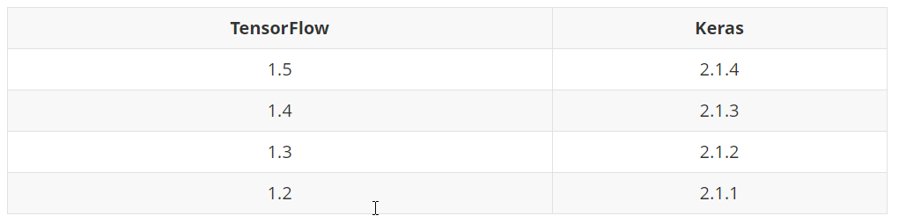

配置 Keras 深度学习环境时需要注意 TensorFlow、Keras、CuDNN(GPU) 版本间的版本配对问题。

## TensorFlow 、CUDA、CuDNN

Linux 下：


Windows 下：


## TensorFlow、Keras



## pip 安装指定版本

```
pip install tensorflow-gpu==1.2.0
pip install keras==2.1.1 -U --pre
```

