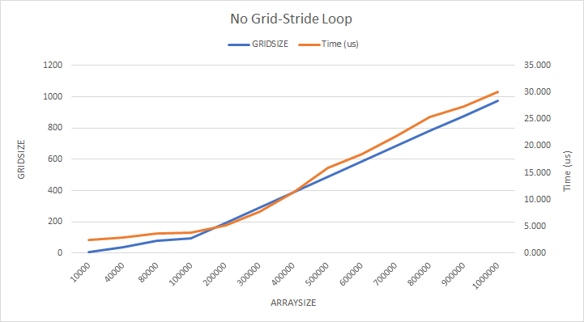

在阅读 CUDA 文档的过程中看到这一篇博文：[CUDA Pro Tip: Write Flexible Kernels with Grid-Stride Loops](https://devblogs.nvidia.com/cuda-pro-tip-write-flexible-kernels-grid-stride-loops/)，觉得是很不错的思想（技巧），因此记录下来，并且附上一些验证数据。

### In theory

问题起源：一般使用 CUDA 并行计算时，总使用一个线程对应一块数据，例如计算两向量之和：

```cpp
// device code to compute c = a + b;
// this method assumes we have enough threads to do the computation
// enough means larger than the size of array a, b and c
__global__
void addArray(int n, float* a, float* b, float* c)
{
    // assume we have 1k elements to compute, in this way
    // thread 0 is responsible for c[0] = a[0] + b[0]
    // thread 1 is responsible for c[1] = a[1] + b[1]
    // and so on
    auto index = blockIdx.x * blockDim.x + threadIdx.x;
    if (index < n)
        c[index] = a[index] + b[index];
}

#define ARRAYSIZE 1000000
#define BLOCKSIZE 1024  // can be any size, better be multiple of 32

__host__
int main()
{
    // ...
    // calculate the minmal number of blocks to cover all data
    auto numBlocks = (ARRAYSIZE + BLOCKSIZE - 1) / BLOCKSIZE;
    addArray <<<numBlocks, BLOCKSIZE >>> (ARRAYSIZE, A, B, C);
    // ...
}
```

如我们所知，CUDA 中线程组织结构从高到低分为 Grid、Block、Warp 三层，这三层中，每一层都有自己能容纳的最大线程数量，例如在我的设备（1080Ti）上，每个 Block 最多容纳 1024 个线程，每个 Warp 固定是 32 个线程，而每个 Grid 能容纳的数量就比较大了（2147483647, 65535, 65535）。同时还有一个条件，每个 multiprocessor 最大容纳 2048 个线程。总而言之，GPU 虽然能提供大量的线程，但并不是无限的。

在不讨论显存大小的前提下，总可能出现这样的情况：程序需要的线程数量大于 GPU 可以提供的线程数量。此时上面的代码就不行了，但下面这种处理方式就可以适应：

```cpp
// another version to compute c = a + b
// this uses grid loop to reuse some threads(if needed)
__global__
void addArray_gird_loop(int n, float* a, float* b, float* c)
{
    // total number of threads in one grid
    // which is accessible to one kernel
    auto stride = blockDim.x * gridDim.x;
    auto index = blockIdx.x * blockDim.x + threadIdx.x;

    // compute using the whole grid at once
    // the reuse the threads in the same grid
    // assume we have 1k elements to compute, and a stride of 100
    // thread 0 is responsible for c[0] = a[0] + b[0]
    //                             c[100] = a[100] + b[100]...
    // thread 1 is responsible for c[1] = a[1] + b[1]
    //                             c[101] = a[101] + b[101]...
    // and so on
    for (int i = index; i < n; i += stride)
        c[i] = a[i] + b[i];
}

#define ARRAYSIZE 1000000
#define BLOCKSIZE 1024  // can be any size, better be multiple of 32
#define GRIDSIZE 10  // can be any size, better be multipel of multiprocessor count

__host__
int main()
{
    // ...
    addArray_gird_loop <<<numBlocks, BLOCKSIZE >>> (ARRAYSIZE, A, B, C);
    // ...
}
```

在这种实现中，每个线程并不只负责一块数据，而是负责从 index 开始，stride 为步长的一组数据。在 kernel 中每个 for 循环的步长（Stride）刚好是一个 Grid 的大小，因此称作（Grid-Stride Loop）。

这种实现的特征是 Grid 的大小可以是任意的，因此解决了「线程不够用」的问题。应该注意到，当 Grid 的大小足够大时（大于等于上一种方法计算出的 `numBlocks`），这种方法就退化到第一种方法。

另外还需要注意到，当 `GRIDSIZE` 与 `BLOCKSIZE` 都取 1 时，GPU 里实际上只有一个线程在跑，于是退化为串行程序。

文首提到的文章总结了这种思路的几个好处：

* **伸缩性与线程复用**。可扩展性是指，这种方法在理论上可以支持任意规模的并行计算，而不受设备提供的最大线程数限制；另外这种实现允许我们采用更合理的 `GRIDSIZE`，比如常推荐的，使用 multiprocessor 数量的倍数。线程复用则可以帮助程序省去线程启动与销毁的开销。

* **易于调试**。如上文所述，当 `GRIDSIZE` 与 `BLOCKSIZE` 都取 1 时程序实际退化为串行程序，这为调试提供了方便（例如在 kernel 中使用 printf 可以得到顺序的结果）。

* **可移植性与可读性**。这种的写法可以轻易地修改为 CPU 代码，另外还有类似 [Hemi](https://devblogs.nvidia.com/parallelforall/simple-portable-parallel-c-hemi-2/) 这样的库专门为 Grid-Stride Loop 提供支持，带来了 C++ 11 风格的循环语法：

  ```cpp
  HEMI_LAUNCHABLE
  void addArray(int n, float* a, float* b, float* c)
  {
      for (auto i : hemi::grid_stride_range(0, n))
        c[i] = a[i] + b[i];
  }
  ```

### In real world

理论上说 Grid-Stride Loop 一切都很美好，但是由于每个线程要进行循环，想必会影响性能，这里我给出自己的测试结果。

测试设备：GeForce GTX 1080Ti

```
CUDA Driver Version / Runtime Version          9.0 / 9.0
CUDA Capability Major/Minor version number:    6.1
Maximum number of threads per multiprocessor:  2048
Maximum number of threads per block:           1024
Max dimension size of a thread block (x,y,z): (1024, 1024, 64)
Max dimension size of a grid size    (x,y,z): (2147483647, 65535, 65535)
```

首先看不使用 Grid-Stride Loop（GS Loop） 的方法中 `GRIDSIZE` 和时间相对 ARRAYSIZE 的变化：



固定 `GRIDSIZE=10`，使用 Grid-Stride Loop 的方法：


直观对比两种方法用时：


可见当 ARRAYSIZE 较大时，两种方法性能有可观的差距。当然，这个测试只是理论上的，实际应用中不可能只用 10 个 Block 来计算。

另外，若将显存大小纳入讨论则情况会稍有不同。向量相加这个例子中需要为相加的两个向量以及存储结果的一个向量在 GPU 上分配显存，有时会遇到这样的情况：线程还没用完，显存先用完了。这种情况与算法相关，并不是所有的程序都需要这么巨大的显存量，但需要巨大线程数的场景比比皆是。

另外，如何将其扩展到高维 Tensor 还有待思考。