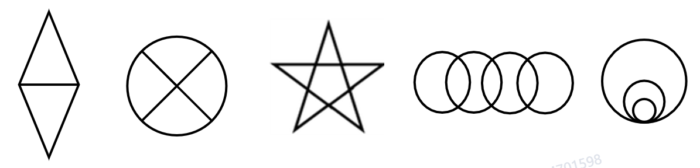
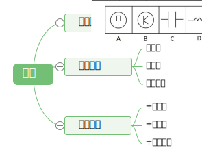
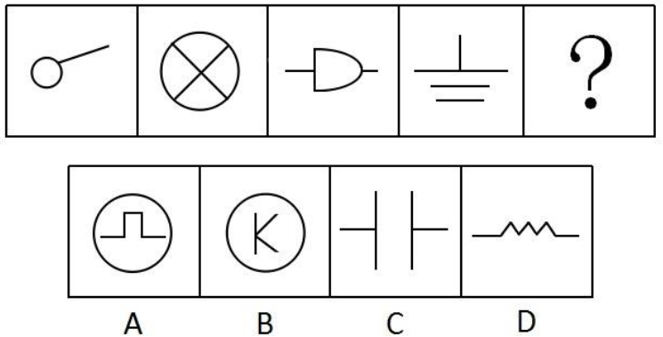
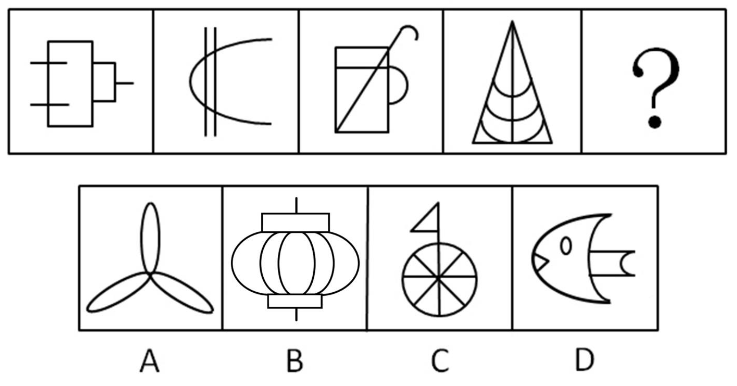
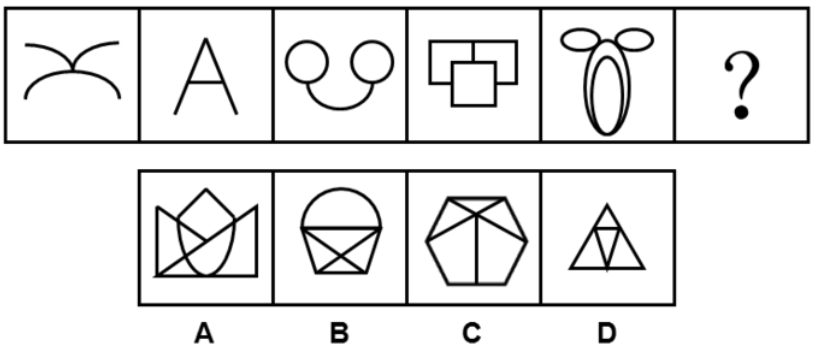

## 一、对称性

### 特征图

轴对称：A、Y、☆、▷

中心对称：S、N、Z、▱

轴对称+中心对称：▞

## 二、笔画数

特征图：“日”、“田”字变形图，五角星、多圆相切或相交。

## 三、曲直

- 属性规律
  - 曲直性(出现全直或全曲图形)
- 数量规律
  - 直线数   
  - 曲线数   
  - 曲直交点
- 复合考点
  - 曲直性+面数量
  - 曲直性+笔画数
  - 曲直性+数量规律

## 四、功能元素

## 五、位置+样式

## 六、空间重构

