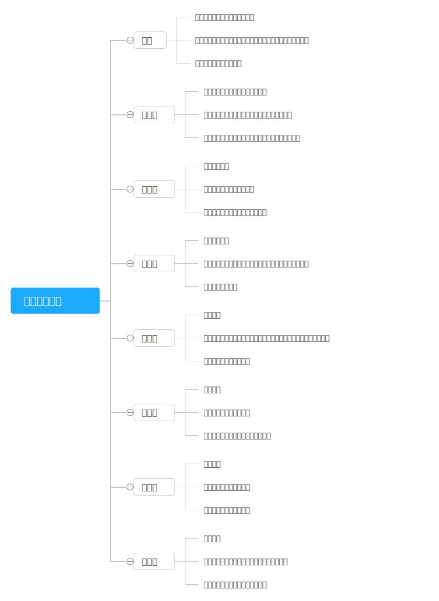
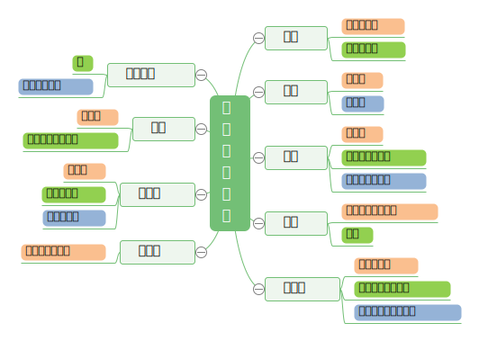

# 民族节日

## 一、汉族节日

## 二、少数民族特色节日

### 1.壮族

【节日】三月三歌节<纪念刘三姐>

【饮食】五色糯米饭

> 海南黎族也有三月三

### 2.傣族

【节日】泼水节

【文化】孔雀舞

### 3.藏族

【节日】雪顿节<酸奶宴会>

【饮食】青稞酒、酥油茶

【文化】格萨尔王、唐卡<卷轴画>

### 4.回族

> 清真寺、伊斯兰教、安拉、穆斯林、阿訇

【节日】开斋节、古尔邦节

【饮食】馓子

### 5.蒙古族

【节日】那达慕大会

【饮食】马奶酒、手抓羊肉

【文化】蒙古长调、嘎达梅林

### 6.维吾尔族

【节日】开斋节、古尔邦节

【饮食】馕

【文化】阿凡提的故事

### 7.满族

【节日】背灯祭

【饮食】萨其马、满汉全席

### 8.朝鲜族

【节日】老人节

【饮食】泡菜、打糕

【文化】《阿里郎》民谣

### 9.高山族

【节日】背篓会、观月祭

